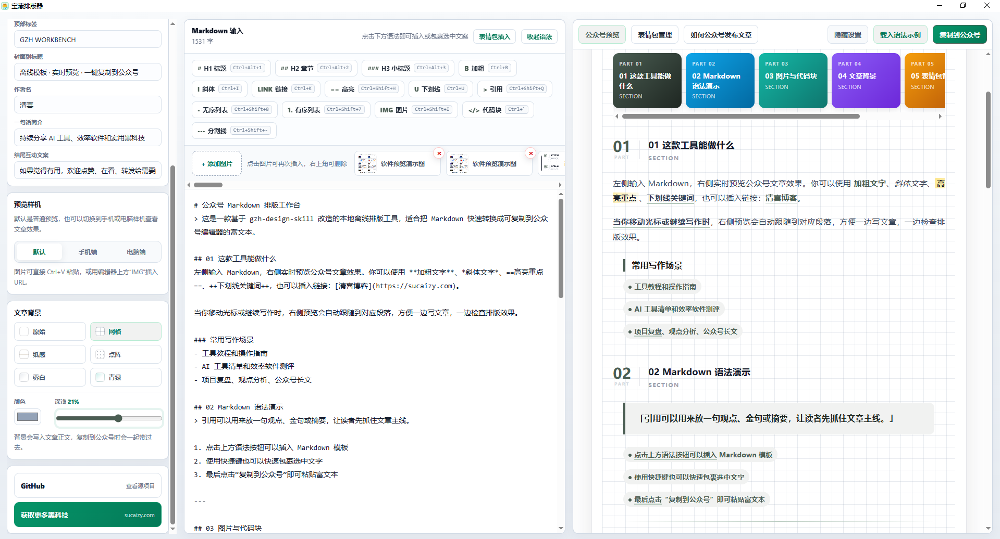
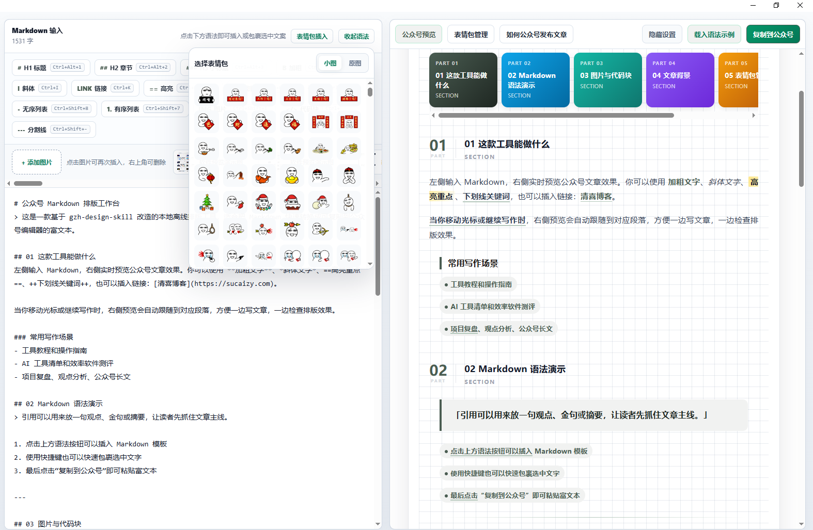
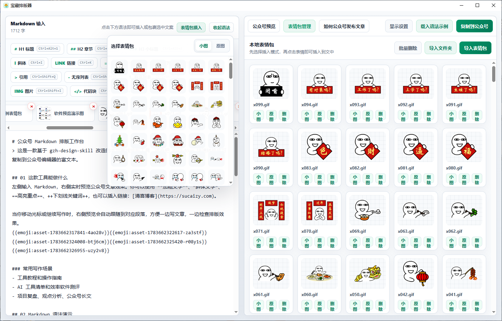
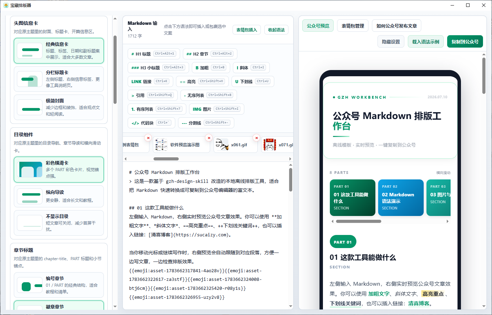
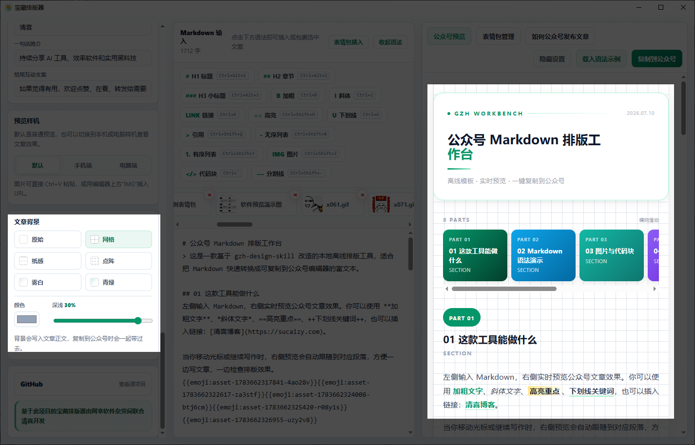

[README.md](https://github.com/user-attachments/files/29877291/README.md)
# 宝藏排版器

宝藏排版器是一款面向微信公众号作者的离线 Markdown 排版工具。它可以把 Markdown 文章实时转换成适合微信公众号编辑器粘贴的富文本样式，让写作、排版、预览和复制发布都在一个桌面软件里完成。

本项目基于开源项目 [isjiamu/gzh-design-skill](https://github.com/isjiamu/gzh-design-skill) 改造而来。原项目提供了优秀的公众号排版主题、组件和转换思路，宝藏排版器在此基础上加入了 Electron 离线界面、实时预览、图片粘贴缓存、表情包管理、样机预览、组件设计和公众号富文本复制等能力。

当前修改维护：清喜  
清喜博客：[https://sucaizy.com](https://sucaizy.com)


## 3.0 版本亮点

- 更清爽的主界面：默认只保留 Markdown 输入区和公众号预览区，功能设置可按需展开。
- 表情包管理：支持导入单个表情包，也支持批量导入整个文件夹。
- GIF 表情支持：导入和复制时保留 GIF 动图，不强制转成静态图。
- 表情快速插入：编辑区上方新增类似聊天软件的表情选择弹窗。
- 小图/原图两种插入方式：小图适合跟在文字后面，原图适合单独作为文章图片。
- 原图比例控制：原图表情默认按 20% 插入，也可以在 Markdown 里继续调整比例。
- 组件设计面板：可切换头图信息卡、目录组件、章节标题、引用样式、图片样式和结尾样式。
- 组件预设保存：常用组件组合可以保存，下次打开继续使用。
- 封面与署名预设：文章标题、作者名、一句话简介、结尾互动文案可保存预设。
- 手机端/电脑端样机预览：支持模拟手机端和电脑端阅读效果。
- 文章背景增强：支持原始、网格、纸感、点阵、雾白、青绿等背景，并可调节颜色和深浅。
- 图片附件清理：新增“图片全清”并带确认弹窗，避免误删。
- 启动优化：减少历史图片缓存对首次启动的影响，打开软件更轻快。
- 复制体验优化：复制为公众号富文本后弹出更明确的提示弹窗。

## 3.0 相比 2.0 的区别

| 对比项 | 2.0 版本 | 3.0 版本 |
| --- | --- | --- |
| 软件定位 | 离线 Markdown 排版器 | 更完整的公众号写作工作台 |
| 主界面 | 功能较集中，设置区域占用更明显 | 默认聚焦输入和预览，设置可隐藏 |
| 表情包 | 初步支持表情插入 | 新增表情包管理、批量导入、GIF 预览、小图/原图插入 |
| 图片复制 | 支持截图和本地图片 | 优化公众号粘贴兼容，新增图片全清确认 |
| 样机预览 | 支持基础预览 | 支持默认、手机端、电脑端多视图切换 |
| 组件样式 | 主要跟随原主题 | 新增组件设计面板和组件预设 |
| 封面署名 | 可填写基础信息 | 支持保存预设，空内容自动隐藏对应结尾样式 |
| 文章背景 | 基础背景效果 | 新增透明网格、纸感、点阵等效果，并支持颜色和强度调节 |
| 示例文章 | 展示基础 Markdown 能力 | 增加表情包、小图、原图、样机、背景和组件能力介绍 |
| 启动体验 | 可能受历史图片缓存影响 | 减少旧缓存恢复，降低首次空白等待 |
| 发布版本 | 2.0 | 3.0 |

## 功能截图

### 主界面和实时预览

左侧输入 Markdown，右侧实时预览公众号排版效果。顶部语法按钮支持快速插入标题、加粗、引用、列表、代码块、图片等常用语法。



### 表情包弹窗

点击“表情包插入”后，可以像聊天软件一样选择表情，并在弹窗里切换“小图”或“原图”插入模式。



### 表情包管理

支持导入单张表情包或整个文件夹，支持 GIF 和常见图片格式。表情包从本地加载，不会增加软件本体体积。



### 手机端样机预览

可切换到手机端样机，提前查看文章在移动端阅读时的排版状态。



### 文章背景设置

文章背景会写入正文，复制到公众号时可以一起带过去。支持透明网格、纸感、点阵等效果，并可调节颜色和深浅。



## 核心功能

- 离线运行：内置 `gzh-design-skill` 主题资源，不依赖在线服务。
- Markdown 写作：支持标题、加粗、斜体、高亮、下划线、引用、列表、代码块、图片和链接。
- 实时预览：写作时右侧自动跟随定位到正在编辑的位置。
- 公众号富文本复制：点击“复制到公众号”后，可直接粘贴到微信公众号编辑器。
- 多主题排版：加载原项目中已注册的 6 套公众号主题。
- 图片管理：支持 `Ctrl+V` 粘贴截图、导入本地图片、删除图片附件和一键清理。
- 表情包管理：支持本地表情包素材库、GIF 预览、小图插入和原图比例插入。
- 组件设计：支持头图信息卡、目录组件、章节标题、引用、图片、结尾等组件样式切换。
- 本地预设：封面署名和组件样式均可保存为本地预设。
- 样机预览：支持默认预览、手机端样机和电脑端样机。

## 基于原项目的改造

原项目 `gzh-design-skill` 提供了微信公众号文章排版的主题、组件和转换思路。宝藏排版器在此基础上主要做了这些本地化改造：

- 将 skill 资源整理为本地离线模板，放入 `resources/skill`。
- 使用 Electron 封装为 Windows 桌面软件。
- 增加 Markdown 实时编辑和右侧实时预览界面。
- 增加公众号富文本复制流程，减少反复调用 skill 的操作成本。
- 增加图片粘贴缓存、本地图片导入和图片附件管理。
- 增加表情包管理、小图插入、原图比例插入和 GIF 预览。
- 增加手机端、电脑端样机预览。
- 增加组件设计、组件预设、封面署名预设、历史文章样式和文章背景设置。
- 增加更适合普通创作者使用的可视化操作界面。

## 安装与运行

安装依赖：

```powershell
npm install
```

本地运行：

```powershell
npm start
```

如果本机已经全局安装 Electron，也可以：

```powershell
electron .
```

自检：

```powershell
npm run check
```

打包 Windows 免安装版：

```powershell
npm run dist
```

## 目录说明

```text
src/                 Electron 主程序与前端界面
resources/skill/     gzh-design-skill 离线主题与脚本资源
scripts/             本地检查脚本
build/               软件图标与打包资源
docs/images/         README 展示截图
```

## 开源协议

本项目基于 [gzh-design-skill](https://github.com/isjiamu/gzh-design-skill) 改造，并遵循 GNU AGPL-3.0-or-later 协议开源。

如果你修改、分发本项目，或将本项目作为网络服务提供给他人使用，需要按照 AGPL-3.0 协议公开对应源代码，并保留原项目作者、项目地址和协议说明。

## 致谢

感谢 `gzh-design-skill` 原作者 **甲木 × 摸鱼小李** 提供优秀的公众号排版主题与组件体系。

- 原项目地址：[https://github.com/isjiamu/gzh-design-skill](https://github.com/isjiamu/gzh-design-skill)
- 当前改造：清喜
- 清喜博客：[https://sucaizy.com](https://sucaizy.com)
