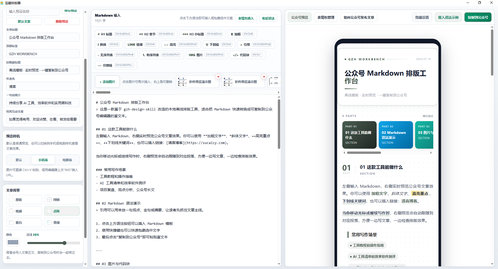
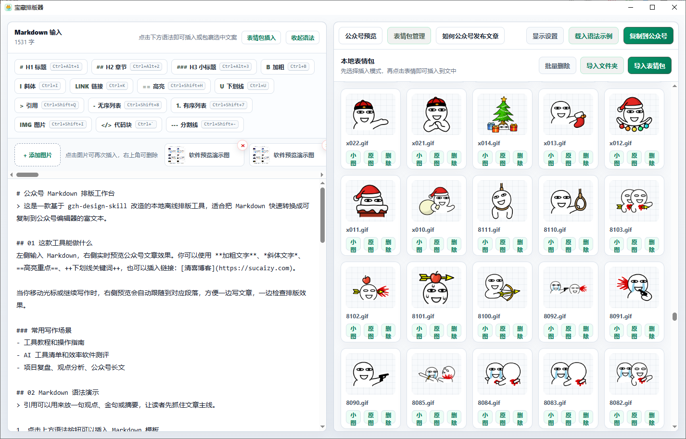

# 宝藏排版器

宝藏排版器是一款面向微信公众号作者的离线 Markdown 排版工具，可以把文章内容实时转换成适合微信公众号编辑器粘贴的富文本样式。

本项目基于开源项目 [isjiamu/gzh-design-skill](https://github.com/isjiamu/gzh-design-skill) 改造而来，在原有公众号排版主题能力的基础上，加入了 Electron 桌面端、实时预览、图片粘贴、表情包管理、样机预览和一键复制到公众号等功能。



## 功能特点

- 离线运行：内置 `gzh-design-skill` 主题资源，不依赖在线服务。
- Markdown 写作：支持标题、加粗、斜体、高亮、引用、列表、代码块、图片、链接等常用语法。
- 实时预览：左侧输入文章，右侧即时显示公众号排版效果。
- 公众号富文本复制：点击复制后，可直接粘贴到微信公众号编辑器。
- 多主题排版：加载原项目中已注册的 6 套公众号主题。
- 封面与署名：支持自定义文章标题、顶部标签、封面副标题、作者名、一句话简介和结尾互动文案。
- 文章背景：支持原始、网格、纸感、点阵、雾白、青绿等背景效果，并可调节颜色和深浅。
- 图片管理：支持 `Ctrl+V` 粘贴截图，也支持导入本地图片并插入文章。
- 表情包管理：支持导入单个表情包或整个文件夹，支持 GIF 和常见图片格式。
- 表情插入：可选择小图插入到文字后，也可按比例插入原图。
- 样机预览：支持默认预览、手机端样机和电脑端样机切换。
- 本地预设：封面与署名内容可保存预设，下次打开继续使用。

## 表情包管理

软件支持把本地表情包作为素材库使用，不会把表情包打进软件本体，方便保持安装包体积小巧。



在写作时，也可以点击编辑区上方的“表情包插入”，像聊天软件一样快速挑选表情。小图适合插入到一句话后面，原图适合单独作为图片素材插入文章。


## 基于原项目的改造

原项目 `gzh-design-skill` 提供了微信公众号文章排版的主题、组件和转换思路。宝藏排版器在此基础上主要做了这些本地化改造：

- 将 skill 资源整理为本地离线模板，放入 `resources/skill`。
- 使用 Electron 封装为 Windows 桌面软件。
- 增加 Markdown 实时编辑和右侧实时预览界面。
- 增加公众号富文本复制流程，减少反复调用 skill 的操作成本。
- 增加图片粘贴缓存和本地图片导入能力。
- 增加表情包管理、小图插入、原图比例插入和 GIF 预览。
- 增加手机端、电脑端样机预览。
- 增加封面署名预设、历史文章样式、文章背景设置等辅助功能。
- 增加适合普通创作者使用的可视化操作界面。

## 安装与运行

克隆项目后安装依赖：

```powershell
npm install
```

本地运行：

```powershell
npm start
```

如果本机已经全局安装 Electron，也可以：

```powershell
electron .
```

自检：

```powershell
npm run check
```

打包 Windows 免安装版：

```powershell
npm run dist
```

## 目录说明

```text
src/                 Electron 主程序与前端界面
resources/skill/     gzh-design-skill 离线主题与脚本资源
scripts/             本地检查脚本
build/               软件图标与打包资源
docs/images/         README 展示截图
```

## 开源协议

本项目基于 [gzh-design-skill](https://github.com/isjiamu/gzh-design-skill) 改造，并遵循 GNU AGPL-3.0-or-later 协议开源。

如果你修改、分发本项目，或将本项目作为网络服务提供给他人使用，需要按照 AGPL-3.0 协议公开对应源代码，并保留原项目作者、项目地址和协议说明。

## 致谢

感谢 `gzh-design-skill` 原作者 **甲木 × 摸鱼小李** 提供优秀的公众号排版主题与组件体系。

- 原项目地址：[https://github.com/isjiamu/gzh-design-skill](https://github.com/isjiamu/gzh-design-skill)
- 当前改造：清喜
- 清喜博客：[https://sucaizy.com](https://sucaizy.com)
